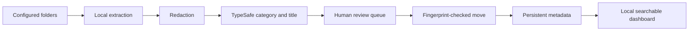

# File Library Organizer

A privacy-conscious macOS workflow for classifying, renaming and organizing images, PDFs and MP4 videos while preserving the original bytes. It combines local extraction, TypeSafe classification, deterministic safety checks, persistent metadata and a searchable local dashboard.

The optional metadata workflow supports a lower-cost first-pass model, a stronger refinement model for uncertain records, and TypeSafe for consistent controlled-topic selection. Model choices are configurable.



## What it does

- Recursively discovers PNG, JPG, WEBP, GIF, HEIC, TIFF, BMP, PDF and MP4 files.
- Waits for new files to settle and reuses evidence and decisions keyed to their fingerprint.
- Uses Apple Vision, PDFKit and AVFoundation locally for OCR, PDF text and sampled video frames.
- Sends redacted text evidence to TypeSafe for category and title selection.
- Routes ambiguous files and every video to a visual review queue.
- Keeps Git projects and configured asset folders in place.
- Refuses overwrites, records recoverable moves and verifies SHA-256 after every move.
- Generates a local dashboard with descriptive metadata search, filters, renaming and macOS Trash controls.

## Requirements

- macOS 13 or newer
- Python 3.9 or newer
- Xcode Command Line Tools with `swiftc`
- A [TypeSafe](https://typesafe.ai/) API key for classification
- Pillow for dashboard previews and review sheets
- Optional: the Codex CLI for descriptive metadata generation

## Setup

```bash
git clone https://github.com/YOUR-ACCOUNT/file-library-organizer.git
cd file-library-organizer
cp config.example.json config.json
make setup
export TYPESAFE_API_KEY="your-key"
```

Edit `config.json` before scanning. Start with a small test folder and confirm the plan before applying it.

If native compilation reports that the macOS SDK is newer than the Swift compiler, update Xcode or the Command Line Tools so the compiler and SDK come from the same release.

## Organize files

```bash
.venv/bin/python organizer.py scan
.venv/bin/python organizer.py extract
.venv/bin/python organizer.py classify
.venv/bin/python organizer.py plan
.venv/bin/python review.py
```

Open `.organizer/review.jpg`, add reviewed decisions with `add-manual.py`, and rerun `plan`. The organizer will refuse `apply` until the review queue is resolved.

```bash
.venv/bin/python organizer.py apply
.venv/bin/python build_dashboard.py
open dashboard/index.html
```

The source files are moved only during `apply`. All prior steps are read-only except for local state and generated previews.

## Descriptive metadata

This optional pipeline creates summaries, keywords, explicit named entities, visible-content phrases, purposes and controlled topics. Valid cache records are reused when the SHA-256 fingerprint and schema version match.

```bash
.venv/bin/python metadata_pipeline.py prepare-bulk
.venv/bin/python metadata_pipeline.py generate FIRST-PASS-MODEL low 8
.venv/bin/python metadata_pipeline.py consolidate FIRST-PASS-MODEL
.venv/bin/python metadata_pipeline.py prepare-refinement
.venv/bin/python metadata_pipeline.py generate-refinement REFINEMENT-MODEL medium 3
.venv/bin/python metadata_pipeline.py apply-refinement REFINEMENT-MODEL
.venv/bin/python metadata_pipeline.py normalize
.venv/bin/python metadata_pipeline.py tags
.venv/bin/python build_dashboard.py
```

Replace the model placeholders with models available to your Codex installation. Set `CODEX_CLI` if `codex` is not on your `PATH`.

## Recovery and undo

Each applied batch is saved under `.organizer/runs/`. Restore one selected run with:

```bash
.venv/bin/python undo-new-files.py .organizer/runs/RUN-DIRECTORY
```

Undo checks fingerprints and stops if a source changed or an original path is occupied.

## Private generated files

Do not commit `config.json`, `.organizer/`, `dashboard/`, exported catalogs, logs or `.env`. They can contain extracted text, private filenames and absolute paths. See [PRIVACY.md](PRIVACY.md) and [SECURITY.md](SECURITY.md).

## License

[MIT](LICENSE)
